Ziqi Huang is a Ph.D. student at [MMLab@NTU](https://www.mmlab-ntu.com), [Nanyang Technological University](https://www.ntu.edu.sg), supervised by [Prof. Ziwei Liu](https://liuziwei7.github.io). She is broadly interested in computer vision and deep learning. She currently works on generative models, visual generation and manipulation.

Ziqi obtained her Bachelor's degree (2022) from [NTU](https://www.ntu.edu.sg), [School of Electrical and Electronic Engineering](https://www.ntu.edu.sg/eee). She is awarded the [Google PhD Fellowship 2023](https://research.google/outreach/phd-fellowship/recipients/), and is a recipient of the [2025 Apple Scholars in AI/ML PhD Fellowship](https://machinelearning.apple.com/updates/apple-scholars-aiml-2025). 
<!-- Previously, she had internships at [ByteDance AI Lab](https://ailab.bytedance.com) and [I2R A*STAR](https://www.a-star.edu.sg/i2r).  -->

[Google Scholar](https://scholar.google.com/citations?user=Y3h_pzMAAAAJ&hl=en) / [GitHub](https://github.com/ziqihuangg) / [X](https://x.com/ziqi_huang_) / [Email](mailto:ZIQI002@e.ntu.edu.sg)

News
-----

∙ [2025-06] We are organizing CVPR 2025 Tutorial <a href="https://world-model-tutorial.github.io">From Video Generation to World Model</a> 
∙ [2025-05] One paper (<a href="https://gordonchen19.github.io/STENCIL-Project/">Stencil</a>) accepted to <a href="https://2025.ieeeicip.org">ICIP 2025</a> as Spotlight 
∙ [2025-05] One paper (<a href="https://arxiv.org/abs/2412.09645">Evaluation Agent</a>) accepted to <a href="https://2025.aclweb.org">ACL 2025</a> (Main Conference) as Oral and SAC Highlights Award (47 out of 8350) 
∙ [2025-03] Awarded <a href="https://machinelearning.apple.com/updates/apple-scholars-aiml-2025">2025 Apple Scholars in AI/ML PhD Fellowship</a> 
∙ [2025-01] Invited talk at <a href="https://www.fudan.edu.cn">Fudan University</a>  
∙ [2024-11] Guest lecture at <a href="https://umich.edu">University of Michigan</a> 
∙ [2024-10] One paper (<a href="https://arxiv.org/abs/2309.15103">LaVie</a>) accepted to <a href="https://link.springer.com/journal/11263">IJCV</a> 
∙ [2024-09] Recognized as <a href="https://eccv.ecva.net/Conferences/2024/Reviewers#all-outstanding-reviewers">ECCV 2024 Outstanding Reviewer</a> 
∙ [2024-08] One paper (<a href="https://arxiv.org/abs/2303.13495">ReVersion</a>) accepted to <a href="https://asia.siggraph.org/2024/">SIGGRAPH Asia 2024</a> 
∙ [2024-07] Invited talk at <a href="https://opendatalab.com">OpenDataLab</a>  
∙ [2024-07] One paper (<a href="https://arxiv.org/abs/2312.07537">FreeInit</a>) accepted to <a href="https://eccv.ecva.net">ECCV 2024</a> 
∙ [2024-06] Invited talk at CVPR 2024 Workshop on <a href="https://sites.google.com/view/loveucvpr24/home">Long Video Understanding</a>  
∙ [2024-04] We are organizing CVPR 2024 Workshop <a href="https://sites.google.com/view/loveucvpr24/home">LOVEU</a> 
∙ [2024-02] Two papers (<a href="https://arxiv.org/abs/2311.17982">VBench</a> & <a href="https://arxiv.org/abs/2309.11497">FreeU</a>) accepted to <a href="https://cvpr.thecvf.com">CVPR 2024</a> (Highlight and Oral) 
∙ [2023-12] One paper (<a href="https://ziqihuangg.github.io/papers/2023TPAMI-TalktoEdit3D.pdf">Talk-to-Edit</a>) accepted to <a href="https://ieeexplore.ieee.org/xpl/RecentIssue.jsp?punumber=34">TPAMI</a> 
∙ [2023-12] We are organizing CVPR 2024 Workshop <a href="https://sites.google.com/view/wicv-cvpr-2024/">Women in Computer Vision (WiCV)</a> 
∙ [2023-11] Awarded <a href="https://research.google/outreach/phd-fellowship/recipients/">Google PhD Fellowship 2023</a> 
∙ [2023-11] Invited talk at <a href="https://research.adobe.com">Adobe Research</a>  
∙ [2023-06] Invited talk at <a href="https://zhidx.com/p/380937.html">Zhi Dongxi</a>  
∙ [2023-10] Awarded Outstanding Reviewer for <a href="https://cveu.github.io">ICCV 2023 Workshop CVEU</a> 
∙ [2023-02] One paper (<a href="https://arxiv.org/abs/2304.10530">Collaborative Diffusion</a>) accepted to <a href="https://cvpr.thecvf.com">CVPR 2023</a> 
∙ [2022-12] We are organizing CVPR 2023 Workshop <a href="https://sites.google.com/view/wicvcvpr2023">Women in Computer Vision (WiCV)</a> 
∙ [2022-09] Awarded <a href="https://undergraduateawards.com/winners/regional-winners-2022">The Global Undergraduate Award</a> Asia Regional Winner 
∙ [2022-08] We are organizing ECCV 2022 Workshop <a href="https://sense-human.github.io">SenseHuman</a> 
∙ [2022-08] Start my journey at <a href="https://www.mmlab-ntu.com">MMLab@NTU</a> as a Ph.D. student 
∙ [2022-06] Awarded <a href="https://www.ntu.edu.sg/eee/about-us/student-awards">Lee Kuan Yew Gold Medal</a> 
∙ [2021-07] One paper (<a href="https://arxiv.org/abs/2109.04425">Talk-to-Edit</a>) accepted to <a href="http://iccv2021.thecvf.com">ICCV 2021</a> 
∙ [2021-05] One paper (<a href="https://ziqihuangg.github.io/papers/2021ICIP-AnalogicalVQA.pdf">AnalogicalVQA</a>) accepted to <a href="https://www.2021.ieeeicip.org">ICIP 2021</a>

Education
-----

### Nanyang Technological University

Aug 2022 - Present 
Ph.D. student at MMLab@NTU 

-----

### Nanyang Technological University

Aug 2018 - May 2022 
B.E. in Information Engineering & Media 
<strong>CGPA: 5.00 / 5.00 (ranking: 1)</strong>

Publications & Preprints
-----

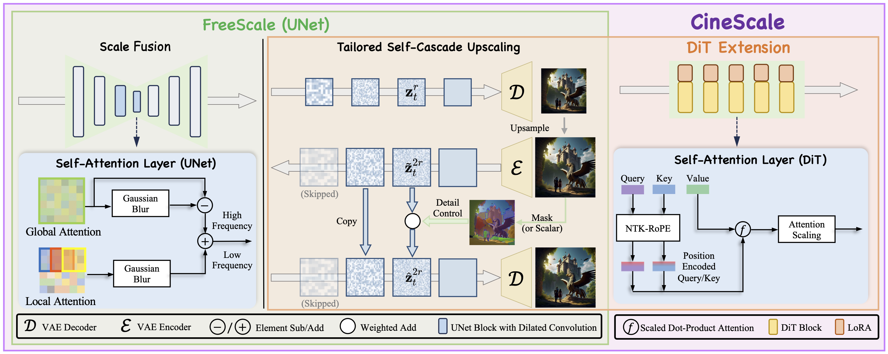
### CineScale: Free Lunch in High-Resolution Cinematic Visual Generation

Haonan Qiu, Ning Yu†, <strong>Ziqi Huang</strong>, Paul Debevec, Ziwei Liu† 
arXiv Preprint, 2025 
<a href="https://arxiv.org/abs/2508.15774">Paper</a> |
<a href="https://github.com/Eyeline-Labs/CineScale">Code</a> |
<a href="https://eyeline-labs.github.io/CineScale/">Project Page</a> |
<a href="https://www.youtube.com/watch?v=bDYmXpNctc4">Video</a>

 

-----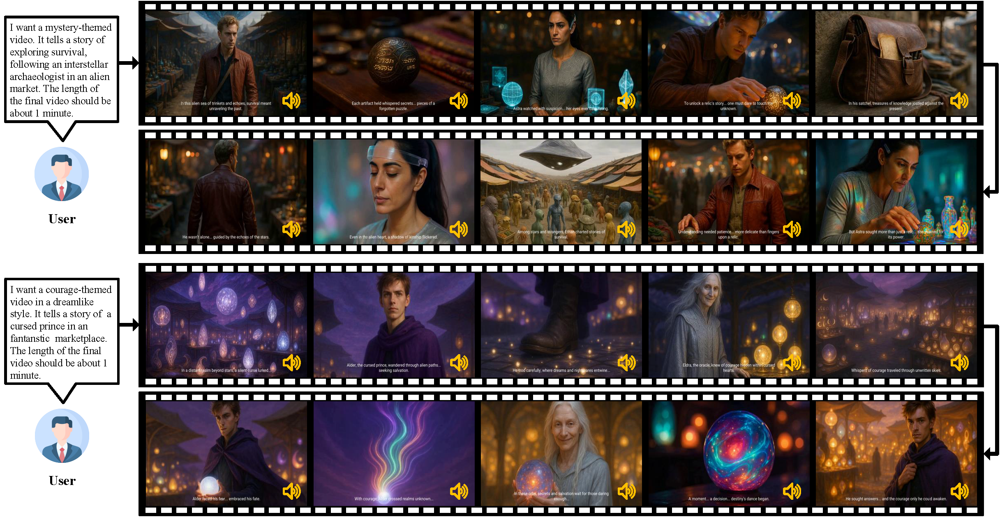
### MAViS: A Multi-Agent Framework for Long-Sequence Video Storytelling

Qian Wang, <strong>Ziqi Huang</strong>, Ruoxi Jia, Paul Debevec, Ning Yu 
arXiv Preprint, 2025 
<a href="https://www.arxiv.org/abs/2508.08487">Paper</a>
 

-----
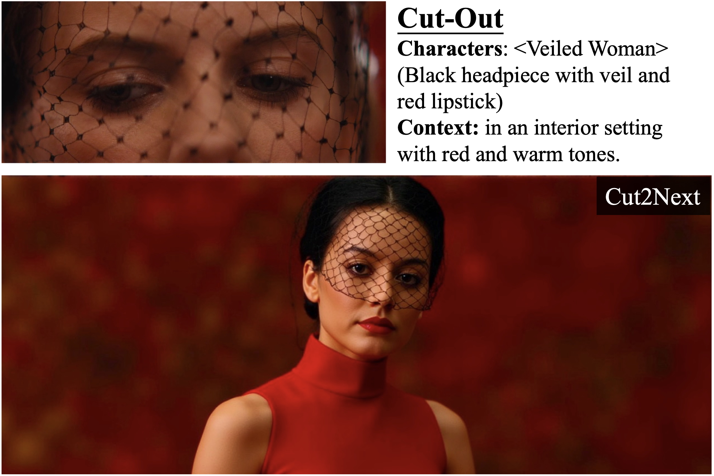
### Cut2Next: Generating Next Shot via In-Context Tuning

Jingwen He, Hongbo Liu, Jiajun Li, <strong>Ziqi Huang</strong>, Yu Qiao, Wanli Ouyang, Ziwei Liu 
arXiv Preprint, 2025 
<a href="https://arxiv.org/abs/2508.08244">Paper</a> | 
<a href="https://vchitect.github.io/Cut2Next-project/">Project Page</a> |
<a href="https://www.youtube.com/watch?v=4-olVWzeXGY">Video</a>
 

-----
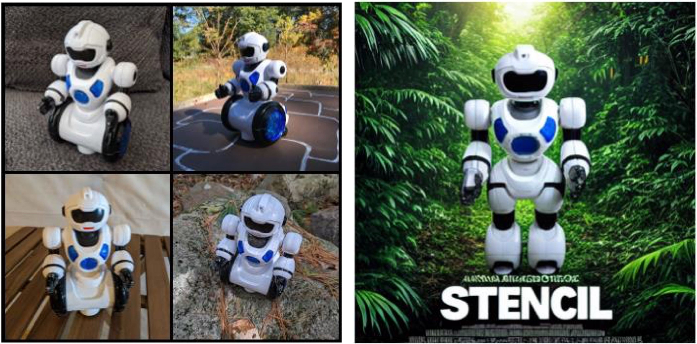
### Stencil: Subject-Driven Generation with Context Guidance

Gordon Chen, <strong>Ziqi Huang</strong>, Cheston Tan, Ziwei Liu 
IEEE International Conference on Image Processing (<strong>ICIP</strong>), 2025, (Spotlight) 
<a href="https://gordonchen19.github.io/STENCIL.github.io/static/pdfs/chen.pdf">Paper</a> | 
<a href="https://github.com/GordonChen19/STENCIL">Code</a> |
<a href="https://gordonchen19.github.io/STENCIL.github.io/">Project Page</a>
 

-----
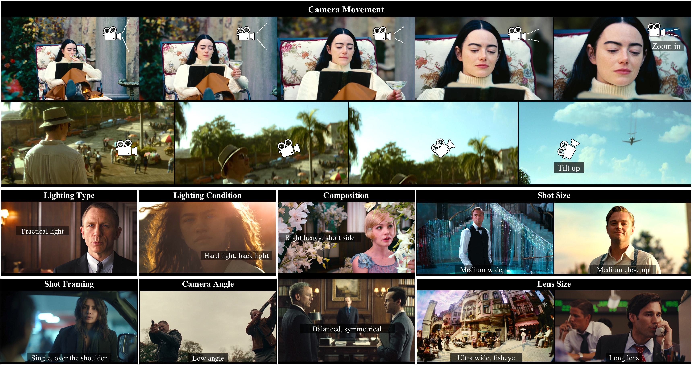
### ShotBench: Expert-Level Cinematic Understanding in Vision-Language Models

Hongbo Liu*, Jingwen He*, Yi Jin, Dian Zheng, Yuhao Dong, Fan Zhang, <strong>Ziqi Huang</strong>, Yinan He, Yangguang Li, Weichao Chen, Yu Qiao, Wanli Ouyang, Shengjie Zhao†, Ziwei Liu† 
arXiv Preprint, 2025 
<a href="https://arxiv.org/abs/2506.21356">Paper</a> | 
<a href="https://github.com/Vchitect/ShotBench">Code</a> |
<a href="https://vchitect.github.io/ShotBench-project/">Project Page</a> |
<a href="https://www.youtube.com/watch?v=MJBJlJEsPFM&t=6s">Video</a>
 

-----
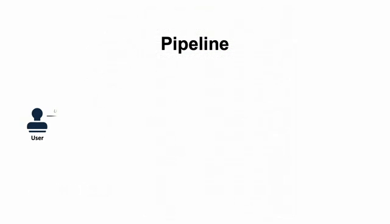
### Evaluation Agent: Efficient and Promptable Evaluation Framework for Visual Generative Models

Fan Zhang*,  Shulin Tian*, <strong>Ziqi Huang‡*</strong>, Yu Qiao†, Ziwei Liu† (‡: project lead) 
Annual Meeting of the Association for Computational Linguistics (<strong>ACL</strong>), 2025 (Main Conference), (Oral) and SAC Highlights Award (47 out of 8350) 
<a href="https://arxiv.org/abs/2412.09645">Paper</a> | 
<a href="https://github.com/Vchitect/Evaluation-Agent">Code</a> |
<a href="https://vchitect.github.io/Evaluation-Agent-project/">Project Page</a> |
<a href="https://www.youtube.com/watch?v=RyAS23dsgP8">Video</a>
 

-----
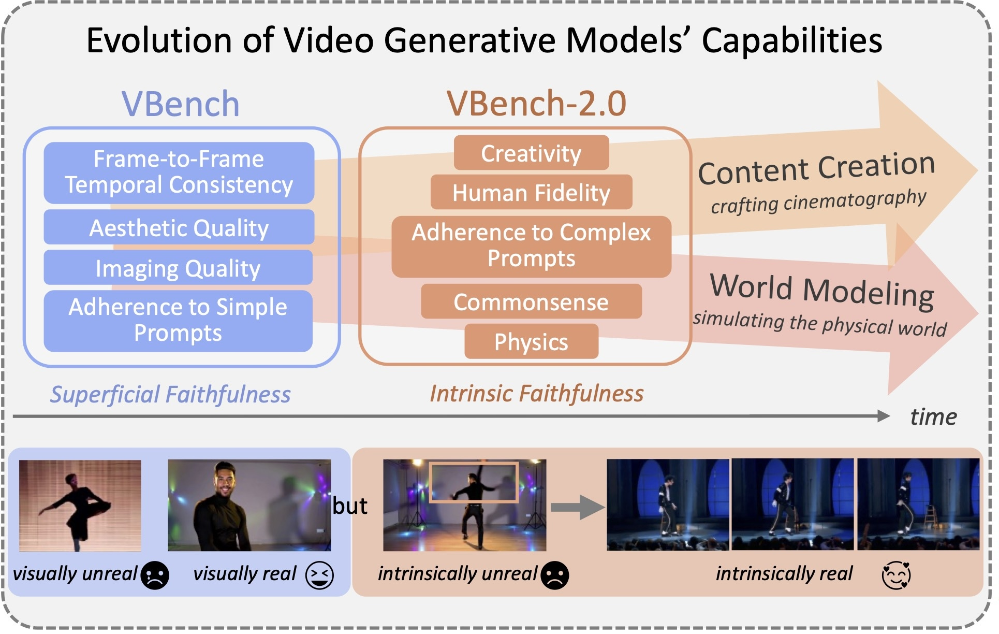
### VBench-2.0: Advancing Video Generation Benchmark Suite for Intrinsic Faithfulness

Dian Zheng*, <strong>Ziqi Huang*</strong>, Hongbo Liu, Kai Zou, Yinan He, Fan Zhang, Yuanhan Zhang, Jingwen He, Wei-Shi Zheng†, Yu Qiao†, Ziwei Liu†  
arXiv Preprint, 2025 
<a href="https://arxiv.org/abs/2503.21755">Paper</a> | 
<a href="https://github.com/Vchitect/VBench">Code</a> |
<a href="https://vchitect.github.io/VBench-2.0-project/">Project Page</a> |
<a href="https://www.youtube.com/watch?v=kJrzKy9tgAc">Video</a> |
<a href="https://huggingface.co/spaces/Vchitect/VBench_Leaderboard">Leaderboard</a> |
<a href="https://huggingface.co/Vchitect">Dataset</a>
 

-----

### RepVideo: Rethinking Cross-Layer Representation for Video Generation

Chenyang Si*, Weichen Fan*, Zhengyao Lv, <strong>Ziqi Huang</strong>, Yu Qiao, Ziwei Liu  
arXiv Preprint, 2025 
<a href="https://arxiv.org/abs/2501.08994">Paper</a> | 
<a href="https://github.com/Vchitect/RepVideo">Code</a> |
<a href="https://vchitect.github.io/RepVid-Webpage/">Project Page</a>
 

-----

### Vchitect-2.0: Parallel Transformer for Scaling Up Video Diffusion Models

Weichen Fan*, Chenyang Si*, Junhao Song, Zhenyu Yang, Yinan He, Long Zhuo, <strong>Ziqi Huang</strong>, Ziyue Dong, Jingwen He, Dongwei Pan, Yi Wang, Yuming Jiang, Yaohui Wang, Peng Gao, Xinyuan Chen, Hengjie Li, Dahua Lin†, Yu Qiao†, Ziwei Liu†  
arXiv Preprint, 2025 
<a href="https://arxiv.org/abs/2501.08453">Paper</a> | 
<a href="https://github.com/Vchitect/Vchitect-2.0">Code</a> |
<a href="https://vchitect.intern-ai.org.cn/">Project Page</a> |
<a href="https://huggingface.co/datasets/Vchitect/Vchitect_T2V_DataVerse">Dataset</a>
 

-----
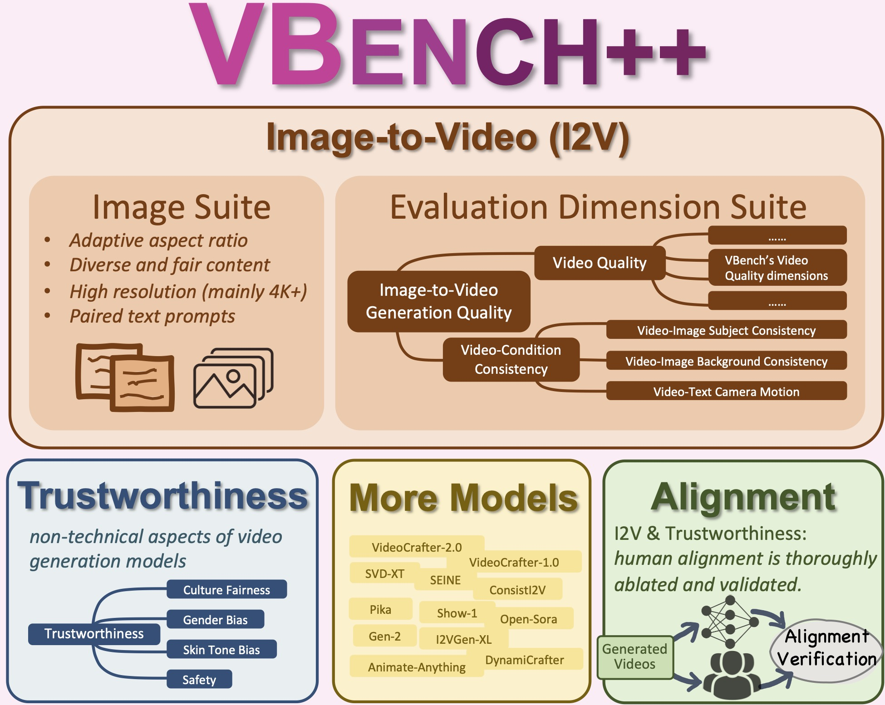
### VBench++: Comprehensive and Versatile Benchmark Suite for Video Generative Models

<strong>Ziqi Huang*</strong>, Fan Zhang*, Xiaojie Xu, Yinan He, Jiashuo Yu, Ziyue Dong, Qianli Ma, Nattapol Chanpaisit, Chenyang Si, Yuming Jiang, Yaohui Wang, Xinyuan Chen, Ying-Cong Chen, Limin Wang, Dahua Lin†, Yu Qiao†, Ziwei Liu†  
arXiv Preprint, 2024 
<a href="https://arxiv.org/abs/2411.13503">Paper</a> | 
<a href="https://github.com/Vchitect/VBench">Code</a> |
<a href="https://vchitect.github.io/VBench-project/">Project Page</a> |
<a href="https://huggingface.co/spaces/Vchitect/VBench_Leaderboard">Leaderboard</a>
 

-----
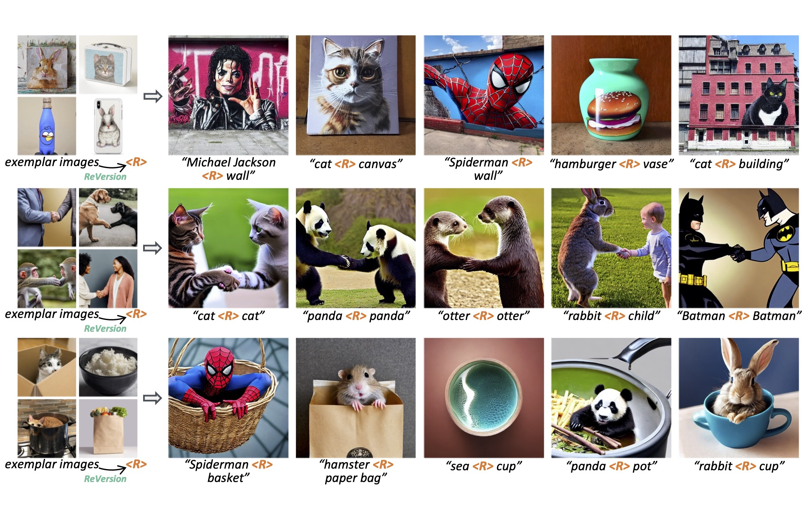
### ReVersion: Diffusion-Based Relation Inversion from Images

<strong>Ziqi Huang*</strong>, Tianxing Wu*, Yuming Jiang, Kelvin C.K. Chan, Ziwei Liu† 
<strong>SIGGRAPH Asia</strong> (Conference Track), 2024  
<a href="https://arxiv.org/abs/2303.13495">Paper</a> | 
<a href="https://www.youtube.com/watch?v=pkal3yjyyKQ">Video</a> |
<a href="https://github.com/ziqihuangg/ReVersion">Code</a> |
<a href="https://ziqihuangg.github.io/projects/reversion.html">Project Page</a> |
<a href="https://drive.google.com/drive/folders/1FU1Ni-oDpxQCNYKo-ZLEfSGqO-j_Hw7X?usp=sharing">Dataset</a> |
<a href="https://huggingface.co/spaces/ChenyangSi/FreeU">Demo</a>
 

-----

### LaVie: High-Quality Video Generation with Cascaded Latent Diffusion Models

Yaohui Wang*, Xinyuan Chen*, Xin Ma*, Shangchen Zhou, <strong>Ziqi Huang</strong>, Yi Wang, Ceuyuan Yang, Yinan He, Jiashuo Yu, Peiqing Yang, Yuwei Guo, Tianxing Wu, Chenyang Si, Yuming Jiang, Cunjian Chen, Chen Change Loy, Bo Dai, Dahua Lin†, Yu Qiao†, Ziwei Liu†  
International Journal of Computer Vision (<strong>IJCV</strong>), 2024 
<a href="https://arxiv.org/abs/2309.15103">Paper</a> | 
<a href="https://vchitect.github.io/LaVie-project/">Project Page</a> |
<a href="https://github.com/Vchitect/LaVie">Code</a>
 

-----
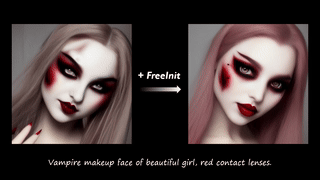
### FreeInit : Bridging Initialization Gap in Video Diffusion Models

Tianxing Wu, Chenyang Si, Yuming Jiang, <strong>Ziqi Huang</strong>, Ziwei Liu†  
European Conference on Computer Vision (<strong>ECCV</strong>), 2024   
<a href="https://arxiv.org/abs/2312.07537">Paper</a> | 
<a href="https://youtu.be/lS5IYbAqriI">Video</a> |
<a href="https://github.com/TianxingWu/FreeInit">Code</a> |
<a href="https://tianxingwu.github.io/pages/FreeInit/">Project Page</a> |
<a href="https://huggingface.co/spaces/TianxingWu/FreeInit">Demo</a>
 

-----
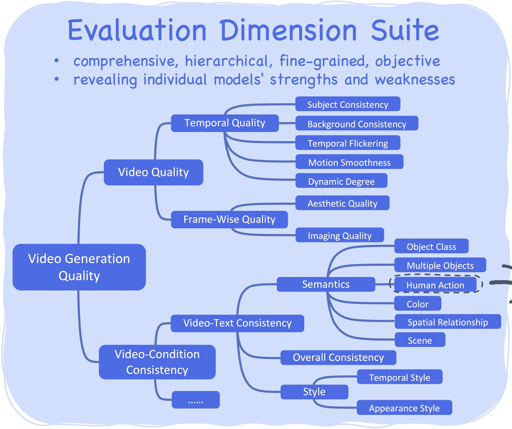
### VBench: Comprehensive Benchmark Suite for Video Generative Models

<strong>Ziqi Huang*</strong>, Yinan He*, Jiashuo Yu*, Fan Zhang*, Chenyang Si, Yuming Jiang, Yuanhan Zhang, Tianxing Wu, Qingyang Jin, Nattapol Chanpaisit, Yaohui Wang, Xinyuan Chen, Limin Wang, Dahua Lin†, Yu Qiao†, Ziwei Liu†  
IEEE/CVF Conference on Computer Vision and Pattern Recognition (<strong>CVPR</strong>), 2024 (Highlight)  
<a href="https://arxiv.org/abs/2311.17982">Paper</a> | 
<a href="https://www.youtube.com/watch?v=7IhCC8Qqn8Y">Video</a> |
<a href="https://github.com/Vchitect/VBench">Code</a> |
<a href="https://vchitect.github.io/VBench-project/">Project Page</a> |
<a href="https://huggingface.co/spaces/Vchitect/VBench_Leaderboard">Leaderboard</a> |
<a href="https://huggingface.co/datasets/Vchitect/VBench_sampled_video/tree/main">Dataset</a>
 

-----
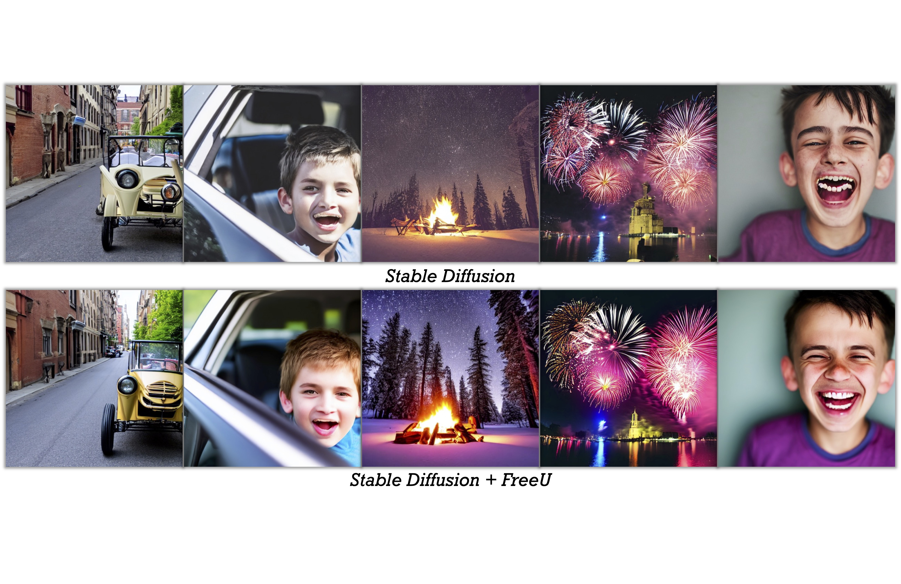
### FreeU: Free Lunch in Diffusion U-Net

Chenyang Si, <strong>Ziqi Huang</strong>, Yuming Jiang, Ziwei Liu† 
IEEE/CVF Conference on Computer Vision and Pattern Recognition (<strong>CVPR</strong>), 2024 (Oral) 
<a href="https://arxiv.org/abs/2309.11497">Paper</a> | 
<a href="https://www.youtube.com/watch?v=-CZ5uWxvX30&t=3s">Video</a> |
<a href="https://github.com/ChenyangSi/FreeU">Code</a> |
<a href="https://chenyangsi.top/FreeU/">Project Page</a> |
<a href="https://huggingface.co/spaces/Ziqi/ReVersion">Demo</a>
 

-----
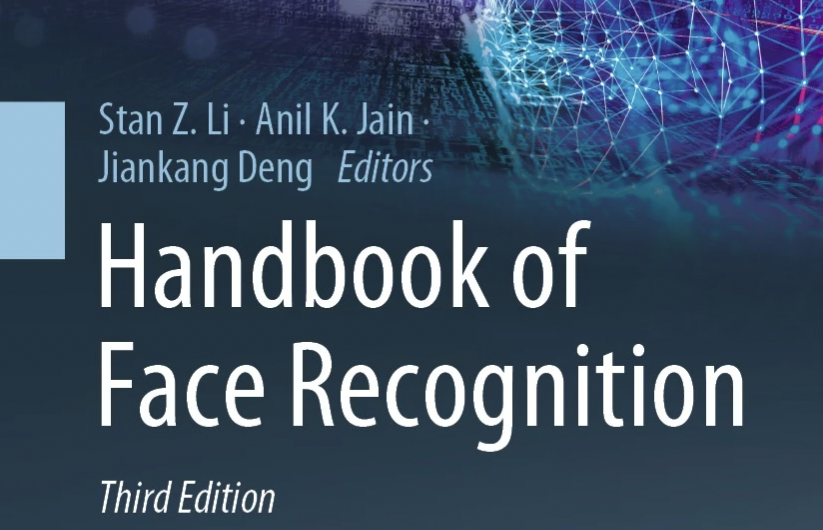
### Generative Networks

Ziwei Liu†, Shuai Yang, Yuming Jiang, <strong>Ziqi Huang</strong> 
Handbook of Face Recognition, Third Edition, 2023 
<a href="https://link.springer.com/chapter/10.1007/978-3-031-43567-6_3">Digital Book</a> 
 

-----
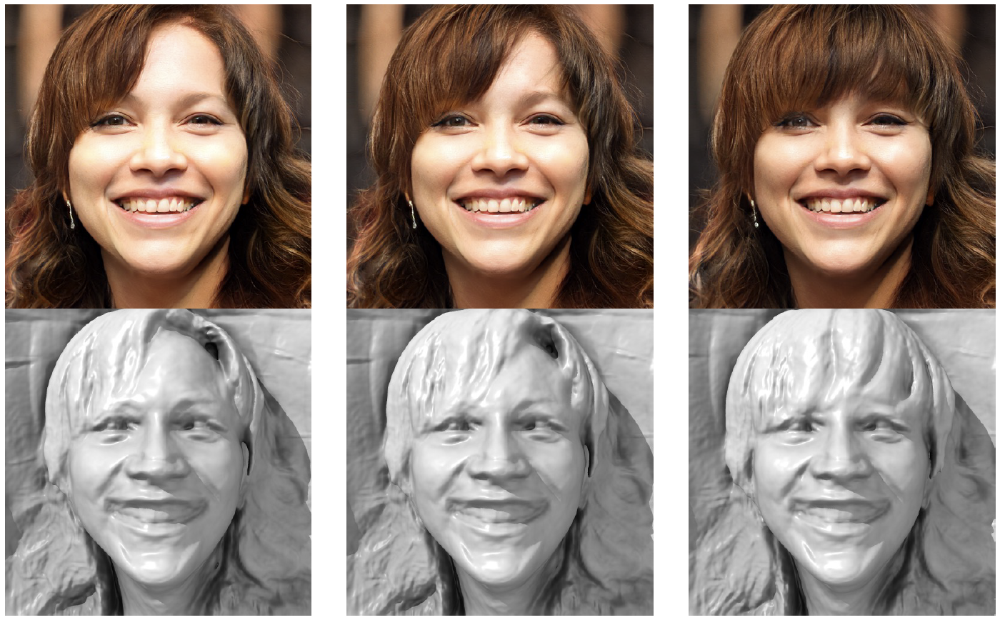
### Talk-to-Edit: Fine-Grained 2D and 3D Facial Editing via Dialog

Yuming Jiang, <strong>Ziqi Huang</strong>, Tianxing Wu, Xingang Pan, Chen Change Loy, Ziwei Liu† 
IEEE Transactions on Pattern Analysis and Machine Intelligence (<strong>TPAMI</strong>), 2023 
<a href="https://ziqihuangg.github.io/papers/2023TPAMI-TalktoEdit3D.pdf">PDF</a> | 
<a href="https://ieeexplore.ieee.org/document/10374263/">Paper</a> | 
<a href="https://www.mmlab-ntu.com/project/talkedit/index.html">Project Page</a>
 

-----
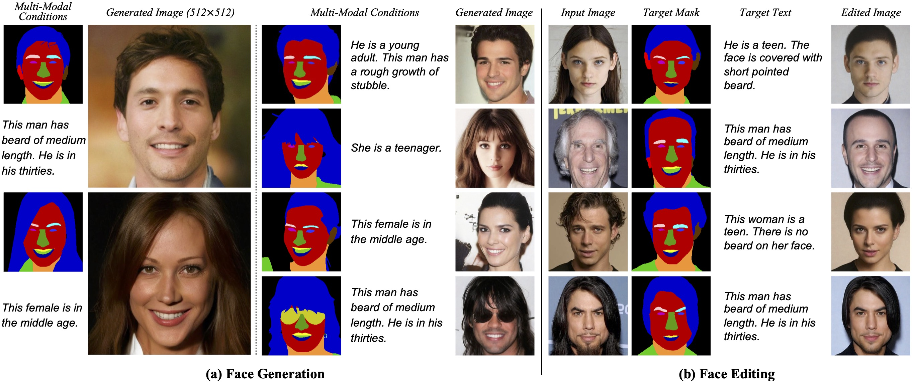
### Collaborative Diffusion for Multi-Modal Face Generation and Editing

<strong>Ziqi Huang</strong>, Kelvin C.K. Chan, Yuming Jiang, Ziwei Liu† 
IEEE/CVF Conference on Computer Vision and Pattern Recognition (<strong>CVPR</strong>), 2023 
<a href="https://arxiv.org/abs/2304.10530">Paper</a> | 
<a href="https://www.youtube.com/watch?v=inLK4c8sNhc">Video</a> |
<a href="https://github.com/ziqihuangg/Collaborative-Diffusion">Code</a> |
<a href="https://ziqihuangg.github.io/projects/collaborative-diffusion.html">Project Page</a>

 

-----

### Talk-to-Edit: Fine-Grained Facial Editing via Dialog

Yuming Jiang*, <strong>Ziqi Huang*</strong>, Xingang Pan, Chen Change Loy, Ziwei Liu† 
IEEE/CVF International Conference on Computer Vision (<strong>ICCV</strong>), 2021 
<a href="https://arxiv.org/abs/2109.04425">Paper</a> | 
<a href="https://www.youtube.com/watch?v=ZKMkQhkMXPI">Video</a> |
<a href="https://github.com/yumingj/Talk-to-Edit">Code</a> |
<a href="https://www.mmlab-ntu.com/project/talkedit/index.html">Project Page</a> |
<a href="https://github.com/ziqihuangg/CelebA-Dialog">Dataset</a>
 

-----
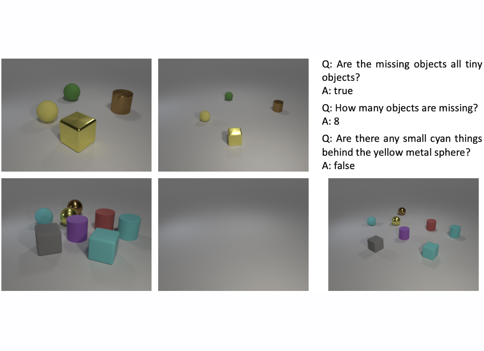
### A Diagnostic Study of Visual Question Answering with Analogical Reasoning

<strong>Ziqi Huang</strong>, Hongyuan Zhu†, Ying Sun, Dongkyu Choi, Cheston Tan, Joo−Hwee Lim 
IEEE International Conference on Image Processing (<strong>ICIP</strong>), 2021 
<a href="https://ziqihuangg.github.io/papers/2021ICIP-AnalogicalVQA.pdf">PDF</a> | 
<a href="https://ieeexplore.ieee.org/document/9506539/">Paper</a> | 
<a href="https://www.youtube.com/watch?v=W1TLrhTKPKE">Video</a>
 

Awards
-----
∙ [2025] [ACL 2025 SAC Highlights Award (47 out of 8350)](https://2025.aclweb.org/program/awards/) 
∙ [2025] [2025 Apple Scholars in AI/ML PhD Fellowship](https://machinelearning.apple.com/updates/apple-scholars-aiml-2025) 
∙ [2024] [ECCV 2024 Outstanding Reviewer](https://eccv.ecva.net/Conferences/2024/Reviewers#all-outstanding-reviewers) 
∙ [2023] [Google PhD Fellowship 2023](https://research.google/outreach/phd-fellowship/recipients/) 
∙ [2023] Outstanding Reviewer, [CVEU Workshop, ICCV 2023](https://cveu.github.io) 
∙ [2022] [The Global Undergraduate Award](https://undergraduateawards.com/winners/regional-winners-2022) Regional Winner (Asia) 
∙ [2022] [Lee Kuan Yew Gold Medal](https://www.ntu.edu.sg/eee/about-us/student-awards) (Top 1 in Undergraduate Cohort) 
∙ [2020 & 2021] NTU President Research Scholar 
∙ [2019 & 2022] Dean’s List (School of Electrical and Electronic Engineering) 
∙ [2018] NTU Science and Engineering Undergraduate Scholarship 

<!-- Talk
-----
∙ [2024-06] Oral Presentation at CVPR 2024 on accepted paper "FreeU: Free Lunch in Diffusion U-Net" ([Slides](https://ziqihuangg.github.io/slides/2024_06_17_freeu_cvpr2024oral.pdf)) 
∙ [2024-06] Invited Talk at CVPR 2024 Workshop on "VBench: Comprehensive Benchmark Suite for Video Generative Models" ([Slides](https://ziqihuangg.github.io/slides/2024_06_17_vbench_cvpr2024workshop.pdf)) 
∙ [2023-10] Invited Talk at Adobe Research on "Exploring Free Lunch in Diffusion U-Net" ([Slides](https://ziqihuangg.github.io/slides/2023_10_30_freeu_adobe.pdf), [Video](https://ziqihuangg.github.io/slides/2023_10_30_freeu_adobe_video.mp4)) 
∙ [2023-06] Invited Talk at Zhi Dongxi (智东西) on "Collaborative Diffusion and Human-Machine Collaborative AIGC" ([Slides](https://ziqihuangg.github.io/slides/2023_06_09_collaborative_diffusion_zhidongxi.pdf))  -->

Professional Service
-----
### Workshop Organizer: 
∙ CVPR 2025 - Organizer - Tutorial: From Video Generation to World Model, [Website](https://world-model-tutorial.github.io) 
∙ CVPR 2024 - Organizer - LOVEU Workshop: Long-form Video Understanding Towards Multimodal AI Assistant and Copilot, [Website](https://sites.google.com/view/loveucvpr24/home) 
∙ CVPR 2024 - General Chair - Women in Computer Vision (WiCV) Workshop, [Website](https://sites.google.com/view/wicv-cvpr-2024/) 
∙ CVPR 2023 - Organizer - Women in Computer Vision (WiCV) Workshop, [Website](https://sites.google.com/view/wicvcvpr2023), [Report](https://arxiv.org/abs/2309.12768), [Video](https://youtu.be/hm1RA4ef7W8) 
∙ ECCV 2022 - Organizer - SenseHuman: Sensing, Understanding and Synthesizing Humans, [Website](https://sense-human.github.io), [Video](https://www.youtube.com/watch?v=B8eyHbdDh14) 

-----
### Talk Organizer: 
∙ [The AI Talks](https://theaitalks.org) - keeping up with the latest advances in AI 

-----
### Reviewer: 
∙ Conference Reviewer: CVPR, ICCV, ICLR, ICIP, ECCV, SIGGRAPH Asia, NeurIPS, ACCV 
∙ Journal Reviewer: IJCV, IET CV, PR 
∙ Workshop Reviewer: ICCV 2023 CVEU Workshop, CVPR 2023 WiCV Workshop

Teaching
-----
∙ Teaching Assistant: SC2001/CE2101/CZ2101 Algorithm Design & Analysis, NTU, 2024 Spring 
∙ Teaching Assistant: SC2001/CE2101/CZ2101 Algorithm Design & Analysis, NTU, 2023 Spring