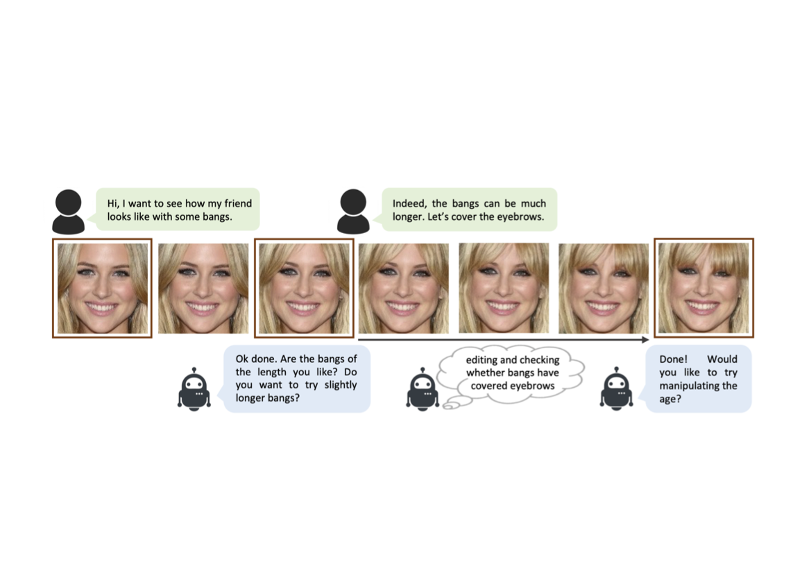
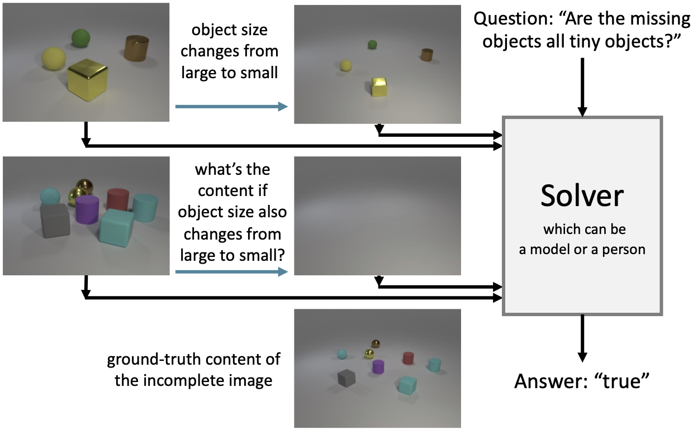

Ziqi Huang is a final-year undergraduate student from School of Electrical and Electronic Engineering (EEE) in Nanyang Technological University (NTU). She is fortunate to be a research student at [MMLab@NTU](https://www.mmlab-ntu.com), supervised by [Prof. Ziwei Liu](https://liuziwei7.github.io). Previously, she had internships at [ByteDance AI Lab](https://ailab.bytedance.com) and [I2R A*STAR](https://www.a-star.edu.sg/i2r). Ziqi Huang is broadly interested in computer vision and deep learning.

News
-----
∙ [07/2021] One paper is accepted to [ICCV 2021](http://iccv2021.thecvf.com) 
∙ [05/2021] One paper is accepted to [ICIP 2021](https://www.2021.ieeeicip.org)

Education
-----

### Nanyang Technological University

Aug 2018 - May 2022 
B.E. in Information Engineering & Media 
<strong>CGPA: 5.00 / 5.00</strong>

Publications
-----

### Talk-to-Edit: Fine-Grained Facial Editing via Dialog

Yuming Jiang*, <strong>Ziqi Huang*</strong>, Xingang Pan, Chen Change Loy, Ziwei Liu 
IEEE International Conference on Computer Vision (<strong>ICCV</strong>), 2021 
[Coming soon]

### A Diagnostic Study of Visual Question Answering with Analogical Reasoning

<strong>Ziqi Huang*</strong>, Hongyuan Zhu, Ying Sun, Dongkyu Choi, Cheston Tan, Joo−Hwee Lim 
IEEE International Conference on Image Processing (<strong>ICIP</strong>), 2021 
[Coming soon]

Awards
-----
∙ \(2018\-2022\) NTU Science and Engineering Undergraduate Scholarship 
∙ \(2019\-2021\) NTU President Research Scholar 
∙ \(2018\-2019\) Dean’s List (School of Electrical and Electronic Engineering)
