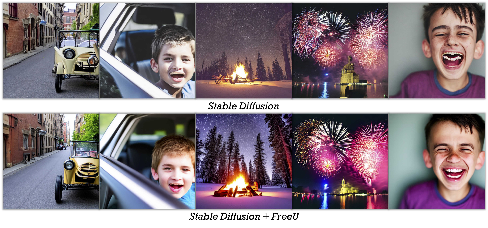

Ziqi Huang is a Ph.D. student at [MMLab@NTU](https://www.mmlab-ntu.com), [Nanyang Technological University](https://www.ntu.edu.sg), supervised by [Prof. Ziwei Liu](https://liuziwei7.github.io). She is broadly interested in computer vision and deep learning. She currently works on generative models, visual generation and manipulation.

Ziqi obtained her Bachelor's degree (2022) from [NTU](https://www.ntu.edu.sg), [School of Electrical and Electronic Engineering](https://www.ntu.edu.sg/eee). Previously, she had internships at [ByteDance AI Lab](https://ailab.bytedance.com) and [I2R A*STAR](https://www.a-star.edu.sg/i2r). 

[Google Scholar](https://scholar.google.com/citations?user=Y3h_pzMAAAAJ&hl=en) / [GitHub](https://github.com/ziqihuangg) / [Twitter](https://twitter.com/ziqi_huang_) / [Email](mailto:ZIQI002@e.ntu.edu.sg)

News
-----
∙ [09/2023] We released [FreeU](https://arxiv.org/abs/2309.11497) and its [code](https://github.com/ChenyangSi/FreeU) 
∙ [04/2023] We released [Collaborative Diffusion](https://ziqihuangg.github.io/projects/collaborative-diffusion.html) (CVPR 2023) and its [code](https://github.com/ziqihuangg/Collaborative-Diffusion) 
∙ [03/2023] We released [ReVersion](https://ziqihuangg.github.io/projects/reversion.html) and its [code](https://github.com/ziqihuangg/ReVersion) 
<!-- ∙ [02/2023] One paper is accepted to [CVPR 2023](https://cvpr.thecvf.com)  -->
<!-- ∙ [12/2022] We are organizing [Women in Computer Vision (WiCV) Workshop](https://sites.google.com/view/wicv/) at CVPR 2023  -->
<!-- ∙ [09/2022] Awarded [The Global Undergraduate Award](https://undergraduateawards.com/winners/regional-winners-2022) Regional Winner (Asia)  -->
<!-- ∙ [08/2022] We are organizing [SenseHuman Workshop](https://sense-human.github.io) at ECCV 2022 
∙ [08/2022] Release [CelebA-Dialog](https://github.com/ziqihuangg/CelebA-Dialog), a large-scale visual-language face dataset 
∙ [08/2022] Start my journey at [MMLab@NTU](https://www.mmlab-ntu.com) as a PhD student 
∙ [06/2022] Awarded [Lee Kuan Yew Gold Medal](https://www.ntu.edu.sg/convocation/about-convocation/medals-and-prizes/lee-kuan-yew-gold-medal) (Top 1 in Undergraduate Cohort) 
∙ [07/2021] One paper is accepted to [ICCV 2021](http://iccv2021.thecvf.com) 
∙ [05/2021] One paper is accepted to [ICIP 2021](https://www.2021.ieeeicip.org) -->

Education
-----

### Nanyang Technological University

Aug 2022 - Present 
Ph.D. student at MMLab@NTU 

-----

### Nanyang Technological University

Aug 2018 - May 2022 
B.E. in Information Engineering & Media 
<strong>CGPA: 5.00 / 5.00 (ranking: 1)</strong>

Preprint
-----

### FreeU: Free Lunch in Diffusion U-Net

Chenyang Si, <strong>Ziqi Huang</strong>, Yuming Jiang, Ziwei Liu 
arXiv Preprint, 2023 
<a href="https://arxiv.org/abs/2309.11497">Paper</a> | 
<a href="https://www.youtube.com/watch?v=-CZ5uWxvX30&t=3s">Video</a> |
<a href="https://github.com/ChenyangSi/FreeU">Code</a> |
<a href="https://chenyangsi.top/FreeU/">Project Page</a>
 

-----

### ReVersion: Diffusion-Based Relation Inversion from Images

<strong>Ziqi Huang*</strong>, Tianxing Wu*, Yuming Jiang, Kelvin C.K. Chan, Ziwei Liu 
arXiv Preprint, 2023 
<a href="https://arxiv.org/abs/2303.13495">Paper</a> | 
<a href="https://www.youtube.com/watch?v=pkal3yjyyKQ">Video</a> |
<a href="https://github.com/ziqihuangg/ReVersion">Code</a> |
<a href="https://ziqihuangg.github.io/projects/reversion.html">Project Page</a> |
<a href="https://drive.google.com/drive/folders/1FU1Ni-oDpxQCNYKo-ZLEfSGqO-j_Hw7X?usp=sharing">Dataset</a> |
<a href="https://huggingface.co/spaces/Ziqi/ReVersion">Demo</a>
 

Publications
-----

### Collaborative Diffusion for Multi-Modal Face Generation and Editing

<strong>Ziqi Huang</strong>, Kelvin C.K. Chan, Yuming Jiang, Ziwei Liu 
IEEE/CVF Conference on Computer Vision and Pattern Recognition (<strong>CVPR</strong>), 2023 
<a href="https://arxiv.org/abs/2304.10530">Paper</a> | 
<a href="https://www.youtube.com/watch?v=inLK4c8sNhc">Video</a> |
<a href="https://github.com/ziqihuangg/Collaborative-Diffusion">Code</a> |
<a href="https://ziqihuangg.github.io/projects/collaborative-diffusion.html">Project Page</a>

 

-----

### Talk-to-Edit: Fine-Grained Facial Editing via Dialog

Yuming Jiang*, <strong>Ziqi Huang*</strong>, Xingang Pan, Chen Change Loy, Ziwei Liu 
IEEE/CVF International Conference on Computer Vision (<strong>ICCV</strong>), 2021 
<a href="https://arxiv.org/abs/2109.04425">Paper</a> | 
<a href="https://www.youtube.com/watch?v=ZKMkQhkMXPI">Video</a> |
<a href="https://github.com/yumingj/Talk-to-Edit">Code</a> |
<a href="https://www.mmlab-ntu.com/project/talkedit/index.html">Project Page</a> |
<a href="https://github.com/ziqihuangg/CelebA-Dialog">Dataset</a>
 

-----

### A Diagnostic Study of Visual Question Answering with Analogical Reasoning

<strong>Ziqi Huang</strong>, Hongyuan Zhu, Ying Sun, Dongkyu Choi, Cheston Tan, Joo−Hwee Lim 
IEEE International Conference on Image Processing (<strong>ICIP</strong>), 2021 
<a href="https://ieeexplore.ieee.org/document/9506539/">Paper</a> | 
<a href="https://www.youtube.com/watch?v=W1TLrhTKPKE">Video</a>
 

Awards
-----
∙ \(2022\) [The Global Undergraduate Award](https://undergraduateawards.com/winners/regional-winners-2022) Regional Winner (Asia) 
∙ \(2022\) [Lee Kuan Yew Gold Medal](https://www.ntu.edu.sg/eee/about-us/student-awards) (Top 1 in Undergraduate Cohort) 
∙ \(2020 & 2021\) NTU President Research Scholar 
∙ \(2019 & 2022\) Dean’s List (School of Electrical and Electronic Engineering) 
∙ \(2018\) NTU Science and Engineering Undergraduate Scholarship 

Professional Service
-----
Workshops Organizer: 
∙ CVPR 2023 - [Women in Computer Vision (WiCV) Workshop](https://sites.google.com/view/wicv/) 
∙ ECCV 2022 - [SenseHuman Workshop](https://sense-human.github.io) 

-----
Talks Organizer: 
∙ [The AI Talks](https://theaitalks.org) - keeping up with the latest advances in AI 

-----
Reviewer: 
∙ CVPR, ICCV, ICIP, IJCV, IET CV

Teaching
-----
∙ Teaching Assistant: SC2001/CE2101/CZ2101 Algorithm Design & Analysis, NTU, 2023 Spring