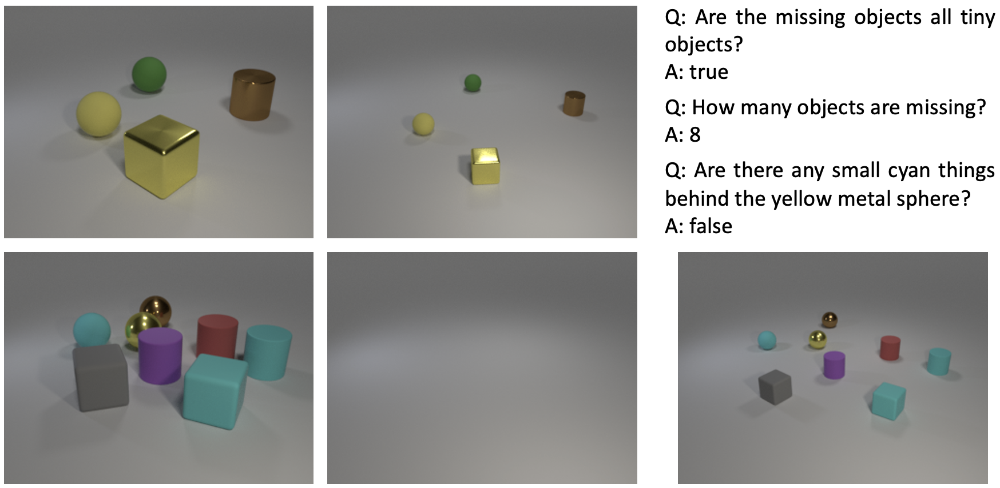

Ziqi Huang is a first-year Ph.D. student at [MMLab@NTU](https://www.mmlab-ntu.com), [Nanyang Technological University](https://www.ntu.edu.sg), supervised by [Prof. Ziwei Liu](https://liuziwei7.github.io). She is broadly interested in computer vision and deep learning. She currently works on generative models, visual generation and manipulation.

Ziqi obtained her Bachelor's degree (2022) from [NTU](https://www.ntu.edu.sg), [School of EEE](https://www.ntu.edu.sg/eee). Previously, she had internships at [ByteDance AI Lab](https://ailab.bytedance.com) and [I2R A*STAR](https://www.a-star.edu.sg/i2r). 

[Google Scholar](https://scholar.google.com/citations?user=Y3h_pzMAAAAJ&hl=en) / [GitHub](https://github.com/ziqihuangg) / [Twitter](https://twitter.com/ziqi_huang_) / [Email](mailto:ZIQI002@e.ntu.edu.sg)

News
-----
∙ [12/2022] We are organizing [Women in Computer Vision (WiCV) Workshop](https://sites.google.com/view/wicv/) at CVPR 2023 
∙ [09/2022] Awarded [The Global Undergraduate Award Regional Winner (Asia)](https://undergraduateawards.com/winners/regional-winners-2022) 
∙ [08/2022] We are organizing [SenseHuman Workshop](https://sense-human.github.io) at ECCV 2022 
∙ [08/2022] Release [CelebA-Dialog](https://github.com/ziqihuangg/CelebA-Dialog), a large-scale visual-language face dataset 
∙ [08/2022] Start my journey at [MMLab@NTU](https://www.mmlab-ntu.com) as a PhD student 
∙ [06/2022] Awarded [Lee Kuan Yew Gold Medal](https://www.ntu.edu.sg/convocation/about-convocation/medals-and-prizes/lee-kuan-yew-gold-medal) (Top 1 in Undergraduate Cohort) 
∙ [07/2021] One paper is accepted to [ICCV 2021](http://iccv2021.thecvf.com) 
∙ [05/2021] One paper is accepted to [ICIP 2021](https://www.2021.ieeeicip.org)

Education
-----

### Nanyang Technological University

Aug 2022 - Present 
Ph.D. student at MMLab@NTU 

-----

### Nanyang Technological University

Aug 2018 - May 2022 
B.E. in Information Engineering & Media 
<strong>CGPA: 5.00 / 5.00 (Rank 1)</strong>

Publications
-----

### Talk-to-Edit: Fine-Grained Facial Editing via Dialog

Yuming Jiang*, <strong>Ziqi Huang*</strong>, Xingang Pan, Chen Change Loy, Ziwei Liu 
IEEE International Conference on Computer Vision (<strong>ICCV</strong>), 2021 
<a href="https://arxiv.org/abs/2109.04425">Paper</a> | 
<a href="https://www.youtube.com/watch?v=ZKMkQhkMXPI">Video</a> |
<a href="https://github.com/yumingj/Talk-to-Edit">Code</a> |
<a href="https://www.mmlab-ntu.com/project/talkedit/index.html">Project Page</a> |
<a href="https://github.com/ziqihuangg/CelebA-Dialog">Dataset</a>
 

-----

### A Diagnostic Study of Visual Question Answering with Analogical Reasoning

<strong>Ziqi Huang</strong>, Hongyuan Zhu, Ying Sun, Dongkyu Choi, Cheston Tan, Joo−Hwee Lim 
IEEE International Conference on Image Processing (<strong>ICIP</strong>), 2021 
<a href="https://ieeexplore.ieee.org/document/9506539/">Paper</a> | 
<a href="https://www.youtube.com/watch?v=W1TLrhTKPKE">Video</a>
 

Awards
-----
∙ \(2022\) [The Global Undergraduate Award Regional Winner (Asia)](https://undergraduateawards.com/winners/regional-winners-2022) 
∙ \(2022\) [Lee Kuan Yew Gold Medal](https://www.ntu.edu.sg/convocation/about-convocation/medals-and-prizes/lee-kuan-yew-gold-medal) (Top 1 in Undergraduate Cohort) 
∙ \(2021\-2022\) Dean’s List (School of Electrical and Electronic Engineering)
∙ \(2018\-2022\) NTU Science and Engineering Undergraduate Scholarship 
∙ \(2019\-2021\) NTU President Research Scholar 
∙ \(2018\-2019\) Dean’s List (School of Electrical and Electronic Engineering)

Professional Service
-----
Workshop Organizer:
∙ CVPR 2023 - [Women in Computer Vision (WiCV) Workshop](https://sites.google.com/view/wicv/)
∙ ECCV 2022 - [SenseHuman Workshop](https://sense-human.github.io)
Talks Organizer:
∙ [The AI Talks](https://theaitalks.org) - keeping up with the latest advances in AI