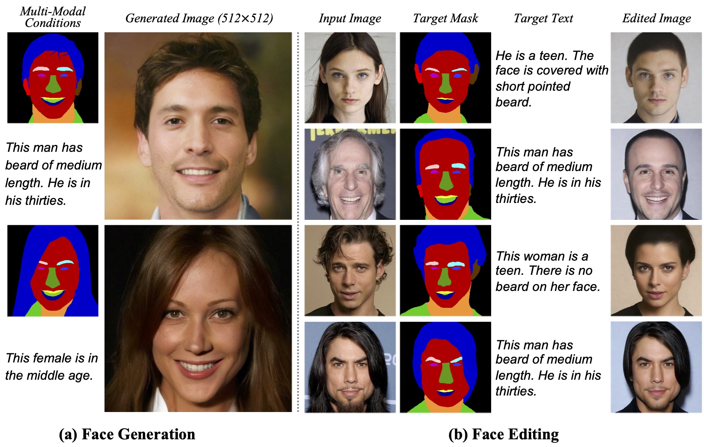

Ziqi Huang is a Ph.D. student at [MMLab@NTU](https://www.mmlab-ntu.com), [Nanyang Technological University](https://www.ntu.edu.sg), supervised by [Prof. Ziwei Liu](https://liuziwei7.github.io). She is broadly interested in computer vision and deep learning. She currently works on generative models, visual generation and manipulation.

Ziqi obtained her Bachelor's degree (2022) from [NTU](https://www.ntu.edu.sg), [School of Electrical and Electronic Engineering](https://www.ntu.edu.sg/eee). She is awarded the Google PhD Fellowship 2023.
<!-- Previously, she had internships at [ByteDance AI Lab](https://ailab.bytedance.com) and [I2R A*STAR](https://www.a-star.edu.sg/i2r).  -->

[Google Scholar](https://scholar.google.com/citations?user=Y3h_pzMAAAAJ&hl=en) / [GitHub](https://github.com/ziqihuangg) / [Twitter](https://twitter.com/ziqi_huang_) / [Email](mailto:ZIQI002@e.ntu.edu.sg)

News
-----
∙ [2024-02] Two papers accepted to [CVPR 2024](https://cvpr.thecvf.com) 
∙ [2023-12] We are organizing [Women in Computer Vision (WiCV) Workshop](https://sites.google.com/view/wicv-cvpr-2024/) at CVPR 2024 
∙ [2023-11] We released [VBench](https://arxiv.org/abs/2311.17982), a comprehensive benchmark for evaluating video generation models. [Code](https://github.com/Vchitect/VBench) is also open-sourced. 
∙ [2023-11] I am awarded the [Google PhD Fellowship 2023](https://research.google/outreach/phd-fellowship/recipients/) 
∙ [2023-11] [Invited talk](https://ziqihuangg.github.io/slides/2023_10_30_freeu_adobe.pdf) at Adobe Research on "Exploring Free Lunch in Diffusion U-Net"  
∙ [2023-11] We released [FreeU](https://arxiv.org/abs/2309.11497) and its [code](https://github.com/ChenyangSi/FreeU) 
∙ [2023-11] We released [Collaborative Diffusion](https://ziqihuangg.github.io/projects/collaborative-diffusion.html) (CVPR 2023) and its [code](https://github.com/ziqihuangg/Collaborative-Diffusion) 
∙ [2023-11] We released [ReVersion](https://ziqihuangg.github.io/projects/reversion.html) and its [code](https://github.com/ziqihuangg/ReVersion) 
∙ [2023-10] Awarded Outstanding Reviewer for [CVEU Workshop (ICCV 2023)](https://cveu.github.io) 
∙ [2023-02] One paper is accepted to [CVPR 2023](https://cvpr.thecvf.com) 
∙ [2022-12] We are organizing [Women in Computer Vision (WiCV) Workshop](https://sites.google.com/view/wicvcvpr2023) at CVPR 2023 
∙ [2022-09] Awarded [The Global Undergraduate Award](https://undergraduateawards.com/winners/regional-winners-2022) Regional Winner (Asia) 
∙ [2022-08] We are organizing [SenseHuman Workshop](https://sense-human.github.io) at ECCV 2022 
∙ [2022-08] Release [CelebA-Dialog](https://github.com/ziqihuangg/CelebA-Dialog), a large-scale visual-language face dataset 
∙ [2022-08] Start my journey at [MMLab@NTU](https://www.mmlab-ntu.com) as a Ph.D. student 
∙ [2022-06] Awarded [Lee Kuan Yew Gold Medal](https://www.ntu.edu.sg/eee/about-us/student-awards) (Top 1 in Undergraduate Cohort) 
∙ [2021-07] One paper is accepted to [ICCV 2021](http://iccv2021.thecvf.com) 
∙ [2021-05] One paper is accepted to [ICIP 2021](https://www.2021.ieeeicip.org)

Education
-----

### Nanyang Technological University

Aug 2022 - Present 
Ph.D. student at MMLab@NTU 

-----

### Nanyang Technological University

Aug 2018 - May 2022 
B.E. in Information Engineering & Media 
<strong>CGPA: 5.00 / 5.00 (ranking: 1)</strong>

Publications
-----

### VBench: Comprehensive Benchmark Suite for Video Generative Models

<strong>Ziqi Huang*</strong>, Yinan He*, Jiashuo Yu*, Fan Zhang*, Chenyang Si, Yuming Jiang, Yuanhan Zhang, Tianxing Wu, Qingyang Jin, Nattapol Chanpaisit, Yaohui Wang, Xinyuan Chen, Limin Wang, Dahua Lin†, Yu Qiao†, Ziwei Liu†  
IEEE/CVF Conference on Computer Vision and Pattern Recognition (<strong>CVPR</strong>), 2024 (Spotlight) 
<a href="https://arxiv.org/abs/2311.17982">Paper</a> | 
<a href="https://www.youtube.com/watch?v=7IhCC8Qqn8Y">Video</a> |
<a href="https://github.com/Vchitect/VBench">Code</a> |
<a href="https://vchitect.github.io/VBench-project/">Project Page</a> |
<a href="https://huggingface.co/spaces/Vchitect/VBench_Leaderboard">Demo</a>
 

-----

### FreeU: Free Lunch in Diffusion U-Net

Chenyang Si, <strong>Ziqi Huang</strong>, Yuming Jiang, Ziwei Liu† 
IEEE/CVF Conference on Computer Vision and Pattern Recognition (<strong>CVPR</strong>), 2024 (Oral) 
<a href="https://arxiv.org/abs/2309.11497">Paper</a> | 
<a href="https://www.youtube.com/watch?v=-CZ5uWxvX30&t=3s">Video</a> |
<a href="https://github.com/ChenyangSi/FreeU">Code</a> |
<a href="https://chenyangsi.top/FreeU/">Project Page</a> |
<a href="https://huggingface.co/spaces/Ziqi/ReVersion">Demo</a>
 

-----

### Generative Networks

Ziwei Liu†, Shuai Yang, Yuming Jiang, <strong>Ziqi Huang</strong> 
Handbook of Face Recognition, Third Edition, 2023 
<a href="https://link.springer.com/chapter/10.1007/978-3-031-43567-6_3">Digital Book</a> 
 

-----

### Talk-to-Edit: Fine-Grained 2D and 3D Facial Editing via Dialog

Yuming Jiang, <strong>Ziqi Huang</strong>, Tianxing Wu, Xingang Pan, Chen Change Loy, Ziwei Liu† 
IEEE Transactions on Pattern Analysis and Machine Intelligence (<strong>TPAMI</strong>), 2023 
<a href="https://ziqihuangg.github.io/papers/2023TPAMI-TalktoEdit3D.pdf">PDF</a> | 
<a href="https://ieeexplore.ieee.org/document/10374263/">Paper</a> | 
<a href="https://www.mmlab-ntu.com/project/talkedit/index.html">Project Page</a>
 

-----

### Collaborative Diffusion for Multi-Modal Face Generation and Editing

<strong>Ziqi Huang</strong>, Kelvin C.K. Chan, Yuming Jiang, Ziwei Liu† 
IEEE/CVF Conference on Computer Vision and Pattern Recognition (<strong>CVPR</strong>), 2023 
<a href="https://arxiv.org/abs/2304.10530">Paper</a> | 
<a href="https://www.youtube.com/watch?v=inLK4c8sNhc">Video</a> |
<a href="https://github.com/ziqihuangg/Collaborative-Diffusion">Code</a> |
<a href="https://ziqihuangg.github.io/projects/collaborative-diffusion.html">Project Page</a>

 

-----

### Talk-to-Edit: Fine-Grained Facial Editing via Dialog

Yuming Jiang*, <strong>Ziqi Huang*</strong>, Xingang Pan, Chen Change Loy, Ziwei Liu† 
IEEE/CVF International Conference on Computer Vision (<strong>ICCV</strong>), 2021 
<a href="https://arxiv.org/abs/2109.04425">Paper</a> | 
<a href="https://www.youtube.com/watch?v=ZKMkQhkMXPI">Video</a> |
<a href="https://github.com/yumingj/Talk-to-Edit">Code</a> |
<a href="https://www.mmlab-ntu.com/project/talkedit/index.html">Project Page</a> |
<a href="https://github.com/ziqihuangg/CelebA-Dialog">Dataset</a>
 

-----

### A Diagnostic Study of Visual Question Answering with Analogical Reasoning

<strong>Ziqi Huang</strong>, Hongyuan Zhu†, Ying Sun, Dongkyu Choi, Cheston Tan, Joo−Hwee Lim 
IEEE International Conference on Image Processing (<strong>ICIP</strong>), 2021 
<a href="https://ziqihuangg.github.io/papers/2021ICIP-AnalogicalVQA.pdf">PDF</a> | 
<a href="https://ieeexplore.ieee.org/document/9506539/">Paper</a> | 
<a href="https://www.youtube.com/watch?v=W1TLrhTKPKE">Video</a>
 

Preprints
-----

### FreeInit : Bridging Initialization Gap in Video Diffusion Models

Tianxing Wu, Chenyang Si, Yuming Jiang, <strong>Ziqi Huang</strong>, Ziwei Liu†  
arXiv Preprint, 2023  
<a href="https://arxiv.org/abs/2312.07537">Paper</a> | 
<a href="https://youtu.be/lS5IYbAqriI">Video</a> |
<a href="https://github.com/TianxingWu/FreeInit">Code</a> |
<a href="https://tianxingwu.github.io/pages/FreeInit/">Project Page</a> |
<a href="https://huggingface.co/spaces/TianxingWu/FreeInit">Demo</a>
 

-----

### LaVie: High-Quality Video Generation with Cascaded Latent Diffusion Models

Yaohui Wang*, Xinyuan Chen*, Xin Ma*, Shangchen Zhou, <strong>Ziqi Huang</strong>, Yi Wang, Ceuyuan Yang, Yinan He, Jiashuo Yu, Peiqing Yang, Yuwei Guo, Tianxing Wu, Chenyang Si, Yuming Jiang, Cunjian Chen, Chen Change Loy, Bo Dai, Dahua Lin†, Yu Qiao†, Ziwei Liu†  
arXiv Preprint, 2023 
<a href="https://arxiv.org/abs/2309.15103">Paper</a> | 
<a href="https://vchitect.github.io/LaVie-project/">Project Page</a> |
<a href="https://github.com/Vchitect/LaVie">Code</a>
 

-----

### ReVersion: Diffusion-Based Relation Inversion from Images

<strong>Ziqi Huang*</strong>, Tianxing Wu*, Yuming Jiang, Kelvin C.K. Chan, Ziwei Liu† 
arXiv Preprint, 2023 
<a href="https://arxiv.org/abs/2303.13495">Paper</a> | 
<a href="https://www.youtube.com/watch?v=pkal3yjyyKQ">Video</a> |
<a href="https://github.com/ziqihuangg/ReVersion">Code</a> |
<a href="https://ziqihuangg.github.io/projects/reversion.html">Project Page</a> |
<a href="https://drive.google.com/drive/folders/1FU1Ni-oDpxQCNYKo-ZLEfSGqO-j_Hw7X?usp=sharing">Dataset</a> |
<a href="https://huggingface.co/spaces/ChenyangSi/FreeU">Demo</a>
 

Awards
-----
∙ \(2023\) [Google PhD Fellowship](https://research.google/outreach/phd-fellowship/recipients/) 
∙ \(2023\) Outstanding Reviewer, CVEU Workshop, ICCV 2023 
∙ \(2022\) [The Global Undergraduate Award](https://undergraduateawards.com/winners/regional-winners-2022) Regional Winner (Asia) 
∙ \(2022\) [Lee Kuan Yew Gold Medal](https://www.ntu.edu.sg/eee/about-us/student-awards) (Top 1 in Undergraduate Cohort) 
∙ \(2020 & 2021\) NTU President Research Scholar 
∙ \(2019 & 2022\) Dean’s List (School of Electrical and Electronic Engineering) 
∙ \(2018\) NTU Science and Engineering Undergraduate Scholarship 

Talk
-----
∙ [2023-10] Invited talk at Adobe Research on "Exploring Free Lunch in Diffusion U-Net", [Slides](https://ziqihuangg.github.io/slides/2023_10_30_freeu_adobe.pdf), [Video](https://ziqihuangg.github.io/slides/2023_10_30_freeu_adobe_video.mp4) 
∙ [2023-06] Invited talk at Zhi Dongxi (智东西) on "Collaborative Diffusion and Human-Machine Collaborative AIGC", [Slides](https://ziqihuangg.github.io/slides/2023_06_09_collaborative_diffusion_zhidongxi.pdf) 

Professional Service
-----
Workshops Organizer: 
∙ CVPR 2024 - General Chair - Women in Computer Vision (WiCV) Workshop, [Website](https://sites.google.com/view/wicv-cvpr-2024/) 
∙ CVPR 2023 - Organizer - Women in Computer Vision (WiCV) Workshop, [Website](https://sites.google.com/view/wicvcvpr2023), [Report](https://arxiv.org/abs/2309.12768), [Video](https://youtu.be/hm1RA4ef7W8) 
∙ ECCV 2022 - Organizer - SenseHuman: Sensing, Understanding and Synthesizing Humans, [Website](https://sense-human.github.io), [Video](https://www.youtube.com/watch?v=B8eyHbdDh14) 

-----
Talks Organizer: 
∙ [The AI Talks](https://theaitalks.org) - keeping up with the latest advances in AI 

-----
Reviewer: 
∙ Conference Reviewer: CVPR, ICCV, ICLR, ICIP 
∙ Journal Reviewer: IJCV, IET CV 
∙ Workshop Reviewer: ICCV 2023 CVEU Workshop (Outstanding Reviewer), CVPR 2023 WiCV Workshop

Teaching
-----
∙ Teaching Assistant: SC2001/CE2101/CZ2101 Algorithm Design & Analysis, NTU, 2024 Spring
∙ Teaching Assistant: SC2001/CE2101/CZ2101 Algorithm Design & Analysis, NTU, 2023 Spring